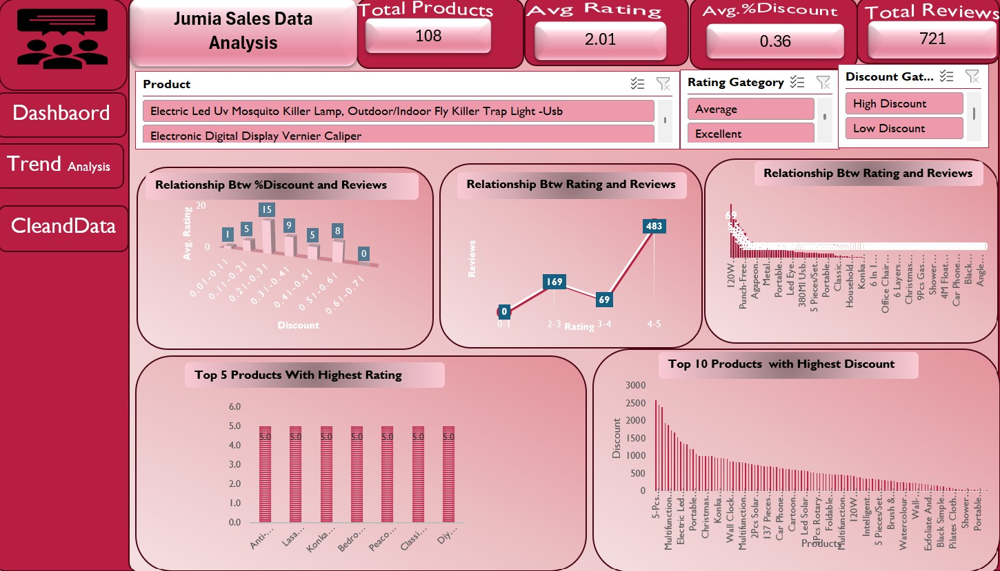

# Jumia Product Performance Dashboard: Analyzing Pricing, Discounts, and Customer Reviews

## 📌 Project Overview
The **Jumia Product Performance Dashboard** is an interactive, Excel-based analytics solution developed to evaluate product performance metrics by analyzing pricing structures, discount distributions, customer ratings, and historical reviews. This project demonstrates end-to-end data processing—transforming raw, messy e-commerce extractions into clean datasets, interactive pivot models, and an executive-facing dashboard that drives data-driven retail decisions.

---

## 💼 Business Problem
E-commerce ecosystems offer vast catalogs with highly dynamic pricing schemas, aggressive promotional discounting, and volatile customer sentiment. Without structured analysis, stakeholders struggle to answer critical retail questions:
1. Which unique products or category segments drive real customer traction?
2. Do high-percentage discount margins actually incentivize meaningful consumer engagement?
3. Which product lines suffer from systemic customer dissatisfaction and require optimization?
4. How do customer ratings correlate with review velocity and overall popularity?

This dashboard translates raw metrics into clear analytical vectors to optimize pricing architectures, promotional margins, and quality control strategies.

---

## 📊 Dataset & Architecture

### Key Data Fields
* **Product Name**: Identifier of the listed e-commerce item.
* **Current Price (KSh)**: Active consumer facing price.
* **Old Price (KSh)**: Historical baseline retail price.
* **Discount Percentage**: Calculated price markdown reduction.
* **Number of Reviews**: Engagement volume proxy.
* **Product Rating**: Customer satisfaction metric scored from 1.0 to 5.0.

### Data Preparation & Feature Engineering
Before analysis, the data underwent rigorous cleaning routines:
* **Deduplication**: Isolated and purged duplicate record instances.
* **Type Casting**: Converted text-formatted currency strings (`KSh 1,580`) into clean numeric integers.
* **Validation**: Audited and handled structural discrepancies and missing records.

To enhance depth, the schema was enriched with calculated variables using advanced Excel logic:
* **Discount Amount**: `= Old Price - Current Price`
* **Rating Category**: Evaluated via conditional logic:
  | Rating Range | Classification |
  | :--- | :--- |
  | **< 3.0** | 🔴 Poor |
  | **3.0 – 4.4** | 🟡 Average |
  | **4.5 – 5.0** | 🟢 Excellent |
* **Discount Category**: Categorized based on markdown thresholds:
  | Discount Percentage | Classification |
  | :--- | :--- |
  | **< 20%** | Low Discount |
  | **20% – 40%** | Medium Discount |
  | **> 40%** | High Discount |

---

## 📈 Key Performance Indicators (KPIs)
The primary layout tracks four baseline performance summary metrics across the portfolio:

| Metric | Baseline Value | Interpretation |
| :--- | :--- | :--- |
| **Total Products** | 108 Items | Portfolio baseline scale |
| **Average Rating** | 2.01 / 5.00 | Systemic satisfaction signal |
| **Average Discount** | 36.37% | Aggressive promotional posture |
| **Total Reviews** | 721 Reviews | Core customer engagement baseline |

---

## 📉 Key Analytical Insights

### 1. The Satisfaction Deficit
The systemic portfolio rating sits at a low **2.01 out of 5**, revealing critical post-purchase friction or quality alignment gaps across a large share of active stock keeping units (SKUs). 

### 2. High Customer Ratings Drive Review Velocity
A strong non-linear correlation exists between top-tier ratings and engagement. Products rated between **4.0 and 5.0 stars generated 483 reviews** (approx. 67% of total volume), showing that highly satisfied customers are disproportionately more likely to leave feedback.

### 3. Promotional Markdown Diminishing Returns
Data reveals that aggressive discounting shares a weak correlation with total review volume. High discounts attract introductory clicks but do not guarantee robust transactional volume or customer retention if the underlying product standard falls short.

### 4. High Margin Erosion Among Top Discounted Items
A deep dive into the top 10 most heavily discounted products exposes extreme price drops (e.g., *5-Pcs Stainless Steel Cooking Pot Set* markdown of KSh 2,585). Over-reliance on severe discounting risks eroding baseline margins, establishing low pricing anchors, and training users to only convert on deep promotions.

---

## 🎯 Strategic Recommendations
* **Implement Strict Supplier QA**: Audit low-tier products (Ratings < 3.0) to eliminate low-quality vendors and protect platform trust.
* **Optimize High-Tier Visual Real Estate**: Feature "Excellent" category products (4.5–5.0 stars) on high-traffic home banners to maximize conversion efficiency.
* **Re-engineer Discount Thresholds**: Shift away from generic high-percentage discount strategies. Instead, target specific categories where price elasticity shows clear conversion gains.
* **Automate Feedback Loops**: Deploy post-purchase follow-up prompts to collect structured feedback on low-review items to fill data gaps.

---

## 🛠️ Tools & Technologies Applied
* **Microsoft Excel**: Dynamic Pivot Architecture, multi-tiered formulas (`IF`, nested lookups), and formatting layers.
* **Interactive Controls**: Slicers for cross-filtering by *Rating Category*, *Discount Category*, and *Product Types*.
* **Visualization Layer**: Multi-axis trend lines, ranked performance bar charts, and conditional KPI cards.

---

## 🖼️ Dashboard Preview

*(Replace this path with your actual image file once uploaded to your assets folder)*

---

## 👤 Author
**Robert Ruto** *Data Analyst | Data Scientist | Researcher* * 🔗 **LinkedIn**: [Robert Ruto](https://www.linkedin.com/in/robert-ruto-4b2166112)
* 🐙 **GitHub**: [@ArapzRuto](https://github.com/ArapzRuto)
